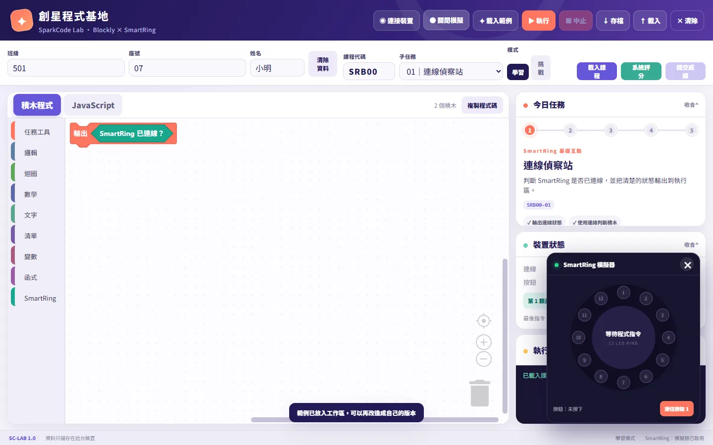

# 創星程式基地｜SparkCode Lab

線上網站：https://shuan14408-ops.github.io/sparkcode-lab/

用 Blockly 積木寫程式，控制 SmartRing（12 顆 LED 的環形燈與按鈕）的線上學習平台。

## 設計理念

- **從積木走向文字程式**：學生拖拉積木時，右側同步顯示對應的 JavaScript，讓學生對照積木的功能和實際的程式碼，為之後轉換到文字程式鋪路。
- **看得到、摸得到的回饋**：程式的結果直接反映在實體 LED 燈環與按鈕上。沒有硬體時也能開啟模擬器練習，讓每位學生都有操作機會。
- **以任務引導學習**：輸入課程代碼（例如 `SRB00`、`CPB00`）載入任務，分成學習與挑戰兩種模式，搭配子任務、提示與系統評分，讓學生知道下一步要做什麼。
- **適合課堂的使用方式**：填寫班級、座號、姓名即可使用，不需註冊帳號；作品與資料只存在學生自己的裝置上，也可以存檔、載入。

## 開發過程

1. 先規劃課堂需求：學生程度、要用的硬體（SmartRing），以及一堂課要完成的任務流程。
2. 使用 AI 程式開發工具協助撰寫程式，再依實際操作的結果反覆調整介面、任務內容與評分方式。
3. 整合 Blockly（繁體中文介面）與 Web Serial API，讓瀏覽器可以直接透過 USB 連接裝置；另外做了模擬器，沒有硬體時也能測試。
4. 完成後發布為靜態網站，部署到 GitHub Pages。

## 技術

- HTML / CSS / JavaScript（無框架）
- [Blockly](https://developers.google.com/blockly) 11
- Web Serial API（連接裝置需使用 Chrome 或 Edge）

## 分支說明

- `main`：原始碼（網站檔案在 `dist/`）
- `gh-pages`：部署到 GitHub Pages 的靜態檔案
